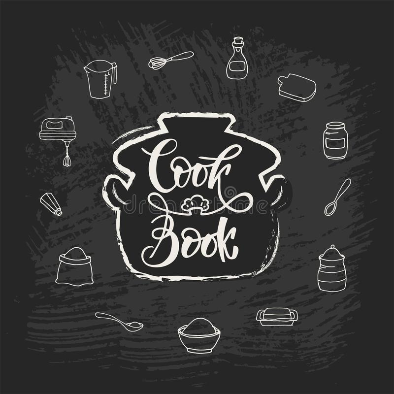

<!-- AUTO-GENERATED-CONTENT:START (STARTER) -->

    

<h1 align="center">
  Welcome to Becky's cookbook
</h1>

### You can view the cookbook live [here](https://rebeccaapollos.github.io/cookbook/)

---

### Instructions to deploy to git

- Check status using `git status`
- Stage changes using `git add .`
- Commit changes to master branch using `git commit -m "commit message"`
- Push changes to github using `git push origin master`
